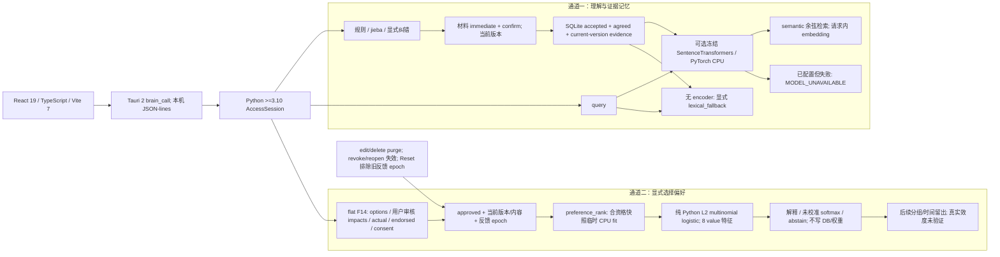

# Local hybrid understanding, evidence memory and choice preference learning

> **RESUMED — 2026-10-04；新 hybrid 主验收未完成。** 初稿日期 2026-10-03。用户已恢复开发，主线程工具目标为 active。[Oct 3 暂停检查点](hybrid-learning-checkpoint-2026-10-03.md) 保留历史；本版修正初稿与检查点指出的漂移。当前源码声明 schema_version=1 / contract_revision=3 / 34 methods；新阶段 [ ] 表示主验收未完成，不表示代码不存在。

## 目标与授权

项目 working goal：本机有限自然语言理解＋可追溯／可编辑证据记忆＋明确选择标签的偏好 ML。SQLite 保存证据，偏好权重为可重新计算的派生层；相似度不证明事实，softmax 不代表已校准的真实选择概率。范围为个人 hybrid 后端；没有 digital-self、心理诊断、MMPI 或真实效度交付声明。

F14 自 Oct 3 已解除延期。材料 immediate/confirm 双 true、实际选择 actual_choice_id、理性事后认可 endorsed_choice_id 与独立 training_consent 分开。首版前端显式提供 options/impacts，由用户审核；不得从日记、embedding、T/F 或模型建议推定标签、影响或同意。开发授权不包含私人语料导入、live DB 操作或权重下载。

主线程目标证据（用户／main 提供）：2026-10-04 本轮开始，线程 `01a0ece3-759d-7ec0-bccc-4157827f3358` 实际 get_goal 为 status=active、objective=`continue build back-end`、tokensUsed=1773028。项目目标继续在此 scope 内。Oct 3 create_goal 因已有未完成目标被拒绝、随后 paused 是历史；早期文档 worker 的 goal=null 不代表主线程，不是当前阻碍。不另建或完成目标。

## 当前事实与证据边界

| 层 | 本机源码／文档依据 | 当前边界 |
| --- | --- | --- |
| 前端／宿主 | 根 package.json：React 19、TypeScript、Vite 7、Tauri CLI ^2.12.0；src-tauri/Cargo.toml：Tauri major 2 | Tauri 2，不是 Tauri 3；前端／Rust 各归 owner，本次仅文档。 |
| 规则与存储 | pyproject.toml Python >=3.10；translator/learning.py jieba；core/store.py SQLite；model/catalog.py 13 参数 | 词汇计数和规则参数不等于通用语义学习，observed=false 不等于测得中性。 |
| 当前扩展 | core/api.py CONTRACT_REVISION=3、METHODS 34 项；core/brain.py 新接入点 | Oct 2 rev2／30 methods 是已验收历史；rev3 最终 schema／生命周期／全量验收仍待 main。 |
| 私有访问与备份 | core/access.py AccessSession；core/backup.py validate_database；tests/test_hybrid_backup.py | 新反馈表曾实际破坏 protected setup/access/backup；精确参考 schema 修复已有子套件证据，完整集成仍待 main。SQLite 明文，同 OS 用户直接文件读取在 gate 范围外。 |
| 语义检索 | translator/semantic.py；core/brain.py memory_search_semantic | 可选冻结本机 encoder、请求内向量；未配置明确 lexical_fallback，配置后失败报错。最新至多 1000 候选池，非无界全集。 |
| 偏好基线 | model/preferences.py；tests/test_preferences.py | 纯 Python L2 multinomial logistic，8 个 value.*；按请求临时 fit，不写 DB/持久权重、不训练 encoder。 |
| 旧评测工具 | model/evaluation.py、model/readiness.py、translator/evaluation.py | 旧规则／收集工具已有历史验收；不证明新偏好 evaluator 已最终交付或真实材料有效。 |

技术候选为 SentenceTransformers 6.1.0／PyTorch CPU；参考源码 ext-refs/sentence-transformers 为 commit `4a3b5cd6ec718e421f57e824a41ed3fd99595df6`、6.2.0.dev0，不是已安装运行版本。BGE-M3 仅候选，无模型权重下载／加载／CPU 性能或真实中文语义验收。

## 技术栈与两条通道



```text
React/TypeScript/Vite -> Tauri 2 brain_call -> Python AccessSession
 通道一：规则/jieba/纠错 -> 来源双确认 -> SQLite 活动证据记忆
          query + memories -> 可选冻结 CPU encoder -> semantic/cosine
          无 encoder -> 明确 lexical_fallback; 已配置失败 -> error
 通道二：前端 options + 用户审核 impacts + actual/endorsed + 独立 consent
          -> approved + 当前版本/内容/反馈 epoch 筛选
          -> preference_rank 临时 L2 logistic fit + 排序/解释/abstain
          -> 不写 DB/持久权重、不训练 encoder -> 后续独立留出
```

## 信号、学习与活动状态

| 字段／操作 | 实际语义 |
| --- | --- |
| immediate/confirm | 整份来源当前版本认可；规则拟合／记忆发布门，不生成 F14 标签或 consent。 |
| actual_choice_id | 实际发生的选项 ID；未知为 null，不自动推断。actual 按来源 partition 隔离。 |
| endorsed_choice_id | 事后认可的选项 ID，可不同于 actual；非空须显式有效 endorsement_partition。只有 rational endorsement 纳入 endorsed/rational target，不把 emotional/crazy 认可升级为理性认可。 |
| training_consent | 显式反馈训练授权，与保存、解锁、材料认可、读取均分开；false 不纳入。 |
| feedback.model_active | 来源 agreed＋双 true＋consent＋匹配 source_version/partition/body_digest＋反馈当前 epoch 的资格；不表示已有持久训练权重。 |
| inputRecord.model_active | 该来源规则 fit 是否属于当前规则模型 epoch；不是反馈资格，也不是选择标签。 |
| choice_feedback_set/get | guarded save 完整替换 source/event 的反馈并推进全局 input revision；get 读取。set/get 不 fit。 |
| preference_rank | 对合资格只读 snapshot 临时 CPU fit＋rank；返回 snapshot input_revision/model_epoch，不写 DB、不持久保存权重、不训练 encoder。不是纯前向读取持久模型。 |

Reset 排除旧反馈 epoch。明确 guarded feedback save 可以重新登记当前 epoch 的反馈，**不要求恢复旧规则 fit**；规则 re-review 不自动重新登记旧反馈。记忆／translator 保留不激活偏好 ML。F6 编辑／删除同事务 purge 反馈；revoke/reopen／版本或内容变化使旧反馈失效。反馈与规则的 model_active 必须独立展示。

## 当前源码签名（rev3 草稿；最终 schema 验收待 main）

```python
memory_search_semantic(query: str, *, partition: str | None = None,
                       limit: int = 20, min_score: float = 0.0) -> dict
choice_feedback_set(source_id: str, *, event_id: str, domain: str,
                    options: list[dict], actual_choice_id: str | None,
                    endorsed_choice_id: str | None,
                    endorsement_partition: str | None, training_consent: bool,
                    expected_source_version: int, expected_revision: int,
                    expected_epoch: int, reason: str | None = None) -> dict
choice_feedback_get(source_id: str) -> dict
preference_rank(options: list[dict], *, target: str, partition: str,
                domain: str) -> dict  # temporary fit + rank, no DB writes
```

JSON params 是闭合、平铺字段，**没有 feedback:dict**。target=actual/endorsed；domain=daily/study/relationships；partition=rational/emotional/crazy。options 的 id 在事件内唯一、不是跨事件稳定类别；impacts 只含有限 [-1,1] 的八个 value.*，缺项贡献 0 不等于真实影响为零。标签非空时必须属于 options；来源可先保存 pending 反馈，但未双确认不得拟合。

expected_revision=GLOBAL input_page.revision／reset_info.input_revision；expected_source_version=当前来源版本；expected_epoch=unlocked health 当前 epoch，不能用历史输入行 epoch 或 correction_history.revision。非负整数且非 bool；事务内再校验，冲突不自动重试。同一 source_id/event_id 完整替换，记录 current source_version、来源 partition、body_digest 和反馈 epoch。

memory_search_semantic 无 encoder 返回 mode=lexical_fallback、score_kind=none、score=null；已配置 path/provider/load/encode 失败返回 MODEL_UNAVAILABLE，不转字面结果。semantic 使用 cosine，保留 memory/evidence、截断标识。先按 accepted/agreed/current-version/partition 筛，取最新至多 1000 项后打分再 limit，返回 pool_count/pool_truncated。返回前复核全局 revision；API 再复查授权。无持久 embedding cache，不因检索发布候选。

## 偏好模型与数值

八个特征：autonomy/fairness/care/truth/security/growth/achievement/connection，字段前缀 value.*；13 个规则参数中的 affect.*／expression.* 不进入此偏好模型。每事件候选 j 的 x_ej∈[-1,1]^8，按 target/partition/domain 分组：

```text
s_ej = w · x_ej
q_ej = exp(s_ej - max_k s_ek) / sum_k exp(s_ek - max_k s_ek)
L(w) = -(1/N_source_IDs) sum_source_ID (1/n_source_ID) sum_event log q_e,y_e
       + (lambda/2) ||w||²
```

Oct 5 当前源码／最终 worker 证据：MIN_SOURCES=3、L2=0.1；纯 Python damped Newton／Cholesky，MAX_ITERATIONS=64、MAX_BACKTRACKS=32，返回权重的 gradient infinity norm 必须 <=1e-11。每步从 1 开始、减半 backtrack，Armijo 系数 0.01；仅在下降量处于 roundoff slack（8 ulps）内时允许 slack，且须同时降低 gradient residual。超预算／无法收敛返回 fit_not_converged，非有限 objective 返回 nonfinite_fit；top gap <=1e-8 返回 options_tied_with_learned_weights。旧 ITERATIONS=400／STEP=0.2 是历史方案。有限数值与梯度检查不代替真实效度或 contrast span 验收。

各 source_id 总 loss 权重相同；不同 ID 不证明独立样本；未知／不可区分标签不进入 fit，跨轴不悄悄池化。3 个不同 IDs 只是探索数量门，不是已验证的样本充分性。当前 used_features 检查只防未使用特征，不证明新组合方向在可辨识子空间。rank_from_fit 在 float 转换前拒绝巨大整数权重并抛受控 ValueError；没有接收外部 fit weights 的 JSON endpoint。返回 weights／contributions／model_probability 带 not_calibrated=true；不能呈现为可靠实际行为概率。模型结果来自返回 tokens 所描述的快照，并发写入后可能过期。

来源筛选缓存只留 bounded metadata／body digest，不缓存完整原文或 i.*；逐个 eligible body 读取，以 65,536 code-point chunks 做 SHA-256；反馈 row 流式遍历。fit records 只保留训练字段，不留原文、reason、option label。1000 current-epoch records 上限和 payload 上限仍限制事件／options 内存，不能宣称总内存为常量。

小 MLP／LoRA 只在独立冻结留出较 logistic 有可复核增益后考虑，需再核对覆盖、泄漏、资源和删除治理；不是当前实现或验收。P1 encoder 始终冻结。

## 阶段与复制／验证路径

- [ ] **P0 契约与完整安全兼容主验收**：保留 Oct 2 rev2 已验收基线，核对 rev3 34-method allowlist/schema/results/health、一致 guards、旧／新 DB 与 backup/restore 严格兼容。参考 core/api.py METHODS/PUBLIC_METHODS/handle、core/access.py AccessSession、core/backup.py validate_database；tests/test_access_api.py、test_schema_contract.py、test_hybrid_backup.py。安全子套件已有中间证据，整体仍待 main 最终验证。
- [ ] **P1 semantic 最终合成主验收**：验证本机 encoder adapter 的 restricted builtin layout、safetensors、禁止 remote/custom/unsafe artifacts、配置失败不 fallback、输出抑制、向量形状、候选池/partition/current-version、长计算后 revision/access 复核、无持久 cache。参考 translator/semantic.py、core/brain.py memory_search_semantic、tests/test_semantic_encoder.py/test_hybrid_api.py。顶层 local_files_only 不足以证明所有嵌套配置离线；真实权重与零网络运行仍未验收。
- [ ] **P2 F14／preferences 最终合成主验收**：验证平铺签名、actual/endorsed、consent、反馈 activity 与规则 activity 分开、目标/分区/domain 隔离、guard 竞争、临时 fit 的 no-write、set/get 不 fit、purge/revoke/reopen、Reset 明确 feedback save。参考 model/preferences.py、model/sources.py purge_dependents、model/reset.py、tests/test_preferences.py/test_hybrid_api.py/test_revisions.py/test_source_governance.py/test_reset.py。F6 source_version 重置为 0 的排队歧义须客户端清队列；未来 content-revision guard 仍待办。
- [ ] **P3 分组／时间留出工具与独立效度**：新偏好 evaluator、合成模板与泄漏验证的交付待 main 最终确认；真实 labels/coverage/prediction 仍未验证。参考 model/readiness.py validate_collection/assess_readiness、model/evaluation.py read_snapshot、docs/readiness.example.json/evaluation.example.json/translator-evaluation.example.json。实际和认可目标分开，复制/摘录/改写同 group，不跨 split；冻结时间、训练暴露/ever_fitted/rule development/人工调参/model-assisted labels 留痕。拒答保留分母、ties 不伪造命中，读取测试标签不得回流训练。
- [ ] **P4 前端/native/离线模型发行**：前端 owner 完成 unlock/cache、guarded version UI、F14 labels/consent/用户审核 impacts、34-method 接线；host owner 验证 administrative Reset/reconnect、ambiguous write 后显式回读、无写重试；release owner 定义本地模型版本/hash/license manifest、依赖包与 CPU RAM/延迟/UI 响应。参考 frontend-contract-handoff.md、desktop-bridge.md、desktop-deployment.md、scripts/native/run.py、scripts/release/test_release.py。Oct 2 release/Xvfb 不等于新 encoder/F14/physical GPU 验收；在线 CI/Python3.10 仍 pending。

main 最终参考命令（本文件 worker 未执行；只使用合成材料／临时库）：

```sh
cd back-end-core
/tmp/alpha-verify-20261004.tPaapz/bin/python -B -m unittest tests.test_semantic_encoder tests.test_preferences tests.test_hybrid_api tests.test_schema_contract tests.test_access_api tests.test_hybrid_backup -q
/tmp/alpha-verify-20261004.tPaapz/bin/python -B -m unittest discover -s tests -q
```

环境路径来自 main，仅本轮有效，不保证后续存在。不安装依赖、不接 live DB、不为文档核对下载权重。文档审计部分不修改 src/、Rust、schema 或 core；各 owner 提供最终源码／签名、命令／结果、访问/rollback/no-write/no-network 范围和缺口，main 审核后再勾选。

## 证据记录与剩余缺口

Oct 2 历史：backend 283/0 skips、translator 7、Rust 16、release 3 及五个 Xvfb native DOM scenarios；不代表当前 hybrid 全量通过。Oct 3 中间 25 semantic pass、27 integration（7 failures/6 errors）保留在检查点，不描述现在最终结果。

Oct 4 中间证据（用户／main 提供）：

- `/tmp/alpha-verify-20261004.tPaapz/bin/python -m unittest tests.test_semantic_encoder tests.test_preferences -q`：semantic 35＋preferences 28 pass、0 skips，无 heavy dependencies；早于当前 offline protection 更新。
- `TMPDIR=/tmp/alpha-verify-20261004.tPaapz /tmp/alpha-verify-20261004.tPaapz/bin/python -B -m unittest tests.test_hybrid_api tests.test_schema_contract tests.test_access_api -q`：39 pass、0 skips，27.496s；main 独立执行，worker 仍加检查。
- backup owner 报 tests.test_hybrid_backup 12 pass/0 skips，security/access/evalaccess 54 pass/0 skips；main 已看过精确 reference schema 修复（6 行，保留 unknown/tampered DDL 拒绝）。这是已测试安全子任务证据，尚非新 hybrid 全量主验收。

//// - [x] **历史已验证子任务｜合成回归及 semantic 复跑**：main 在 back-end-core 执行 `TMPDIR=/tmp/alpha-verify-20261004.tPaapz HF_HUB_OFFLINE=1 TRANSFORMERS_OFFLINE=1 /tmp/alpha-verify-20261004.tPaapz/bin/python -B -m unittest discover -s tests -q`：396 tests、134.672s、OK、0 skips；随后同环境 `-m unittest tests.test_semantic_encoder -q`：51 tests、1.142s、OK、0 skips。其后 discovery 398 项，最后新增两项由 semantic 复跑覆盖；不是一次完整 398 项执行，不相加为互不重复测试数。
//// - [x] **历史已验证子任务｜备份兼容**：main 独立 `tests.test_hybrid_backup` 12 pass／0 skips，11.220s。

上述既有 main 证据更正此前「full-suite 仍运行」中间状态；不覆盖本次后续偏好修复或新 evaluator。semantic 为合成 export／mock，无真实权重。API owner targeted 151 distinct pass 的精确命令尚未提供。本次最终命令／结果由 main 补充，P0–P4 整体继续 [ ]。独立真实语义覆盖、实际权重加载/零网络/CPU 性能、选择预测效度、前端/native/physical 验收均未验证。**No real data used.**

## 上游参考（历史研究依据，本轮未联网）

[SentenceTransformer 官方 API](https://sbert.net/docs/package_reference/sentence_transformer/model.html)、[BAAI BGE-M3 model card](https://huggingface.co/BAAI/bge-m3) 是初稿研究链接。本轮仅按本机源码／检查点修正交接，未联网复查。上游模型能力不证明 Alpha 中文 evidence retrieval 质量、兼容性或 CPU 资源预算；具体模型仍待本地权重及环境验收。

## 偏好阶段仍未接受（Oct 4 review）

Mencius review 历史转交：最多 1000 来源完整 body 缓存潜在约 1GB（40×1m ASCII 合成约 40MB）；400 iterations near-tie winner 与 4000/Newton 不一致；huge integer float 转换 OverflowError；复制／改写 group/provenance 不保证独立；used_features 覆盖不保证新 option contrast 位于可辨识子空间。可执行未勾项见根沟通及 docs/TODO。即使最终合成测试全通过，P2 也不能据此自动验收。

## 当前实现分工（最终证据待 main）

- [ ] Goodall 已交付 digest-only 筛选缓存、收敛纯 Python solver＋near-tie abstain、huge integer weight 受控 ValueError；preferences/tests/schema 归该 owner。当前参数／reasons／资源证据已据源码及最终 worker 报告同步；main/fresh 验收待到，不因 worker 通过而勾选，旧 400 iterations/step=0.2 仅是历史草稿。
- [ ] Zeno 交付 model/preference_evaluation.py、独立测试与 docs/preference-evaluation.md/example.json；文档整合不编辑这四个新文件。冻结 manifest 的 development groups → 共用 production pure fit → 不读 held-out labels 的预测 → 独立 labels 分 actual/endorsed、state/domain 计分 → coverage/abstain/group metrics，须按最终实际 schema 描述，尚不记录为已交付。
- [ ] main 提供后续最终命令／结果并安排 fresh-agent final review；仅已验证自动化子任务使用 `//// - [x]`，不勾整个 P2/P3 或真实效度。

source group/provenance 与 contrast span 的 production/live acceptance 继续待办；离线 evaluator 防跨组泄漏不等于线上已按独立组拟合。不接 DB、不导入私有实际材料、不下载或训练 encoder weights。

## 用户确认的事件组决策（2026-10-05；实现未完成）

**DECISION**：采用用户审核后的事件组 ID，前端显式提供；草稿 `group_id` 保持 PROPOSED，待 main 定稿。一个事件组的所有材料合计一份训练 loss 权重，不按 source_id 数量增加总 mass；actual/endorsed、partition/domain 继续隔离。后端仅提示原文完全重复，不推断不同文本属于同一事件，不自动指定 group 或授予用户审核。

- [ ] **IMPLEMENTATION｜下一阶段 fresh owner**：Goodall 先完成当前基础修复；后续 owner 增加 group 字段、显式用户审核 gate 和按组聚合权重。新规则要求现有反馈绑定已审核组；legacy／未知 group 在用户补审前排除训练。此为未来规则，当前 eligibility／API/schema 尚未实现，不自动回填认可。
- [ ] **前端契约验收**：main／frontend owner 定稿组输入、审核及既有反馈更新协议；所有未定字段保持 PROPOSED，未接线／未验收。

离线 manifest 的 group split 是评测边界，不等于线上组 gate 已落实。contrast span／不可辨识方向的 production 拒答仍为独立待办；本决策不勾 P2/P3 整体。

## Oct 5 中间验证（不勾新子任务）

main 转交 preferences 36 pass、22.441s、0 skips，早于最后新增测试，精确命令尚未提供。main 独立 seed804 对照 assert pass：修复后 winner=b、margin=`1.0117349352838784e-05`；旧 400-step winner=a。此为合成反例证明，不是实际预测效度或最终规模／收敛验收。最终 worker 证据、fresh reviews 和 main 最终 full-suite 齐备前，本次偏好／evaluator 新子任务保持 [ ]；Oct 4 勾项只保留既有历史范围。

## Oct 5 final worker proof — main/fresh acceptance pending

main 转交 Goodall FINAL：preferences 41＋hybrid 21＋schema 18＝80 tests，128.728s，0 skips；精确命令仍待 main。schema 改动只增 fit_not_converged reason enum，没有新增 group 字段。另含 12 backup 的 92 项独立验证及 antipattern/quality reviews 正在运行，尚不记录结果。所有新子任务维持 [ ]。

Worker dense 合成 CPU benchmark：1000 events、8 options、8 features，2.144934741 CPU seconds，最终 gradient infinity norm=2.609e-17。这是 solver 合成观测，不是 API 端到端／实际用户延迟保证。内存案例为 40 distinct sources×1,000,000 code points、1000 events：

| body／consent | Python tracemalloc peak bytes |
| --- | ---: |
| ASCII／false | 55,959 |
| ASCII／true | 2,531,834 |
| Unicode／false | 54,423 |
| Unicode／true | 5,924,752 |

这些值仅是 Python tracemalloc peak，不含 SQLite/native 分配，不能写成 native RSS 或整进程峰值。Worker instrumented test 65.940s 包含追踪与测试开销，其中 CPU 18.66s；两者均不代表正常请求延迟。最终 main 命令／fresh reviews／full-suite 仍待补充；source group 与 contrast span 的下一阶段实现不因这些证据完成。

main 独立基础后端 full discovery 已启动，精确 commands/counts/timing 待提供，不以预期 discovery 数量作结果。P3 tests/docs/example 未 ready；此轮 full 是 scoped base full proof，不是新 evaluator 或 whole hybrid 最终证明。

Oct 5 fresh reviews（main 转交）：antipattern no findings，17 pure tests／parity pass；该隔离环境未装 jsonschema，另一个 full 环境有 validator。quality no blockers、41 preferences pass；uneven mass 7/1/1 的独立 reference difference=1.18e-12，seed804 gradient=3.26e-15／max weight difference=1.89e-12，Cholesky residual=1.39e-17。quality 另测 dense 1000-event／8-option 为 1.48 CPU seconds；不与 worker 2.144934741 CPU seconds 混成单次结果，不代表正常 API 延迟。main 92 项与 scoped base full 411 项仍运行；两者通过才勾三个有限修复子项，线上 group／contrast span／整个 P2/P3 保持 [ ]。

Oct 5 Zeno 报 47 tool tests，但 tests/docs/example 曾误建于根目录；main 要求 owner 用 apply_patch 修正到 back-end-core/tests/test_preference_evaluation.py、docs/preference-evaluation.md、docs/preference-evaluation.example.json（后两者相对 back-end-core）。文档整合不改四个新 owner 文件，不链接根目录错误产物。修正后须在 back-end-core 复核命令／结果并做 fresh tool reviews；当前 411 base full 不含这 47 项，P3 交付仍待确认。

## Oct 5 scoped base acceptance（不含 P3）

main 独立 `TMPDIR=/tmp/alpha-verify-20261004.tPaapz HF_HUB_OFFLINE=1 TRANSFORMERS_OFFLINE=1 /tmp/alpha-verify-20261004.tPaapz/bin/python -B -m unittest discover -s tests -q`（back-end-core）：411 tests、170.066s、OK、0 skips，早于 P3 测试迁移，不含新 evaluator。FreshVerifier 92（41 preferences／21 hybrid／18 schema／12 backup），85.576s、无失败／skips；fresh antipattern 17 pure、quality 41 均无阻碍项。main 补充合成临时 live-API 调用确认 fit_not_converged 全量结果 schema、0 SQL writes／0 encoder calls，source hashes unchanged；不是用户 live DB。此证据更正上文运行中状态，不是整个 hybrid 或新 P3 的最终 full proof。

//// - [x] **有限修复｜digest-only 筛选缓存**：metadata/digest、逐个 body 分块 hash、流式 feedback、训练字段缓存；合成 tracemalloc 验证通过，native RSS／正常延迟不在完成范围。
//// - [x] **有限修复｜收敛与 near-tie 拒答**：当前 Newton/gradient/slack/tie 参数与 fit_not_converged、独立 reference／seed804／残差及失败路径 no-write/no-encoder 证明通过。
//// - [x] **有限修复｜巨大整数权重边界**：float 前 bounded finite 校验及受控 ValueError，合成 preference/hybrid/schema 回归通过。

source groups／review gate／legacy unknown exclusion、contrast span、整个 P2/P3、真实效度、frontend/native 均继续 [ ]。正确路径 [evaluator 说明](preference-evaluation.md) 与 [合成 manifest](preference-evaluation.example.json) 已出现；最终 P3 命令及 fresh tool reviews 仍待 main。
