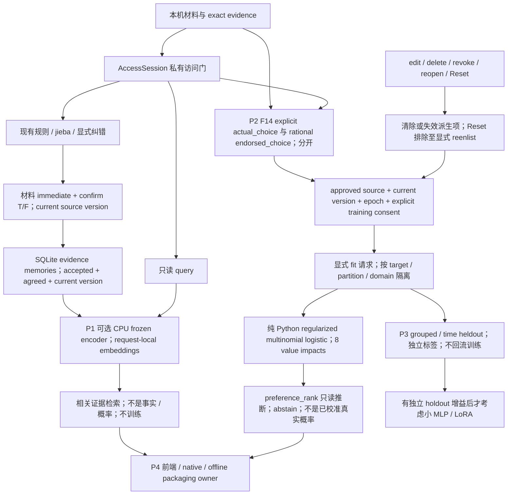

# Local hybrid understanding, evidence memory and choice preference learning

> **PAUSED — 2026-10-03。** 用户已暂停今天的工作。此计划是未完成的文档草稿，下面部分签名、fallback、拟合触发及目标工具描述有漂移；以 [暂停检查点](hybrid-learning-checkpoint-2026-10-03.md) 和根沟通文件最后的暂停记录为准。不要将此草稿视为已发布 API 契约或完整验收。

日期：2026-10-03。状态：main-authored synthesis 的文档转录；开发已获授权，本阶段仅写文档。所有阶段复选框表示 planned / not implemented，只有 main 核对实际实现与验收证据后才可勾选。**No real data used.** 未读私人语料、未开实际用户库、未导入／训练／下载模型权重；未改代码或提交／推送 Git。

## 工作目标与范围状态

项目 working goal：在本机组合有限自然语言理解、可追溯／可修改的证据记忆、用户明确标注的选择偏好 ML。记忆和来源保存在 SQLite；ML 是对合资格标签的可重算派生层。检索用于找相关证据，不证明事实或完整理解；选择排序不承诺预测人的真实行为。digital-self、心理诊断和 MMPI 不在这个目标内。

用户现已授权 hybrid 开发，F14 不再 deferred。此计划与 [追加沟通记录](../../front-back-communicate.md) 覆盖旧文档的 F14 延期范围表述；原文作为历史保留。[api.md](api.md)、[api.schema.json](api.schema.json)、[frontend-contract-handoff.md](frontend-contract-handoff.md) 仍定义当前已实现契约，新方法还不在其中。开发授权不等于私人材料导入、个别反馈训练同意或模型下载授权。

目标设置工具的既有记录（用户提供）：**BLOCKED — usageLimited，unfinished prior goal**。本阶段不替换／完成该旧目标，只在此记录新项目工作目标；没有调用 create_goal，没有创建产品 active goal。本次只读 get_goal 返回 goal=null，未复现上述历史拒绝，不能声称工具目前已有新目标或本次调用被拒绝。项目计划可以记录，产品功能和工具 active goal 都没有因此产生。

## P0 静态发现：当前实际基础

| 事实 | 本轮源码／契约依据 | 适用边界 |
| --- | --- | --- |
| 桌面为 Tauri 2 | 根 [package.json](../../package.json) 的 @tauri-apps/cli ^2.12.0；[Cargo.toml](../../src-tauri/Cargo.toml) tauri／tauri-build major 2 | [Cargo.lock](../../src-tauri/Cargo.lock):3099 为 tauri 2.11.5，:3150 为 tauri-build 2.6.3；[package-lock.json](../../package-lock.json):1299 为 CLI 2.12.0。声明／锁文件证据，不是本轮运行时测量；不是 Tauri 3。 |
| 前端 React 19、TypeScript、Vite 7 | 根 package.json dependencies／devDependencies | 只读核对版本；本轮不改 `src/`，不验收当前用户前端变更。 |
| 核心 Python >=3.10，SQLite，jieba | [pyproject.toml](../pyproject.toml) 的 requires-python；[translator/learning.py](../translator/learning.py):16、:22、:50 | dependencies=[] 不代表无需 tokenizer：jieba 从 ext-refs/jieba 或已安装副本加载。词汇计数／分词提示不等于语义学习。 |
| schema_version=1、contract_revision=2、30 methods | [core/api.py](../core/api.py):22–55；api.md 的 All 30 typed methods；schema `#/$defs/request/properties/method`、`#/$defs/results/$defs/health` | `memory_search_semantic`、`choice_feedback_set/get`、`preference_rank` 均不存在于当前方法集合；不提前升级版本或声称支持。 |
| 私有访问门已存在 | [core/access.py](../core/access.py):146 AccessSession、:208 require、:220 check_authorized；core/api.py:138 handle | public 仅 health/baseline/access_status/unlock/lock；locked health 不读库且无 model_epoch。SQLite 仍明文，应用 gate 不阻止同 OS 用户直接读文件。 |
| 证据记忆可活动查询 | [core/brain.py](../core/brain.py):212 `_memories`、:249 memory_list、:253 memory_search | accepted candidate＋agreed source＋source_version 相等；当前检索是 claim/evidence 字面匹配。Reset 保留这些记忆，不等于它们仍参与选择模型。 |
| 当前 rank 是规则价值对齐 | [model/ranking.py](../model/ranking.py):9 VALUE_PARAMETERS、:12 validate_options、:32 rank_from_state；[model/engine.py](../model/engine.py):791 rank_options | 使用 rational 状态、support>=2；返回 abstain 或 provisional、not_a_probability=true。不是已训练 logistic／神经网络。 |
| 当前 catalog 为 13 参数，选择特征取其中 8 个 value.* | [model/catalog.py](../model/catalog.py):9–16；[model/baseline.json](../model/baseline.json)；schema `#/$defs/parameter` | affect.*／expression.* 不纳入本次选择基线；零状态 observed=false 不等于测得中性。 |
| 只读评估／收集工具已有 | [model/evaluation.py](../model/evaluation.py):27、:76、:172；[model/readiness.py](../model/readiness.py):80、:254、:259 | 旧评估仅 rational 对齐；readiness 分组／时间／暴露检查不能证明声明为真。不是 F14 写入或新 ML holdout evaluator。 |

本轮高置信度来自上述静态文件；旧 283 backend／7 translator／16 Rust 等测试数只在历史交接中记录，本阶段未复跑，不用来证明 hybrid 实现。当前真实数据语义覆盖、选择效度、CPU 编码性能、离线 encoder 发行和新增前端／native 接线都未验证。

## 信号和学习层必须分开

| 信号／层 | 含义 | 不可替代的信号 |
| --- | --- | --- |
| immediate / confirm（整份材料 T/F） | 当前 source/version 的双认可；现有规则拟合／记忆发布 gate | 不是 actual_choice、endorsed_choice，也不是新增 F14 training_consent。 |
| actual_choice | 该事件里实际发生的选项 ID；未知为 null | 不从情绪词、记忆检索、T/F、模型首选推导。 |
| endorsed_choice | 用户理性回顾后认可的选项 ID；可以不同于实际选择，未知为 null | 不要求相同，不把 emotional／crazy 材料认可自动升级为 rational 认可。 |
| training_consent（计划） | 对明确 target／partition／domain、当前来源版本／epoch 的显式训练授权 | 保存反馈、查看反馈、解锁或阅读排序不会自动给出此同意。 |
| encoder inference | 冻结预训练参数，将 query／证据片段转为向量 | read-only inference，不训练 encoder，不写记忆或个人模型。 |
| preference inference | 使用明确拟合产生且仍有效的派生权重排序 | preference_rank 不调用 fit，不以读取触发后台训练。 |
| explicit fit（计划） | 显式请求下从合资格反馈派生选择权重 | 不把原文／证据记忆压入预训练 encoder 权重，不在连接／get／search／rank 时训练。 |

## Hybrid 流程（planned）



ASCII fallback（与图相同的边界）：

```text
local source -> AccessSession -> rules/jieba/corrections -> material T/F
   |                                                       |
   |                                                       v
   |                         SQLite accepted/agreed/current-version memories
   |                                                       |
   |                    read-only query -> optional CPU frozen encoder
   |                                       -> related evidence (not truth)
   v
explicit F14: actual_choice != necessarily rational endorsed_choice
   -> approved source + current version + epoch + separate training_consent
   -> explicit fit request -> isolated target/partition/domain logistic weights
   -> read-only preference_rank (no training; abstain; not calibrated probability)
   -> grouped/time heldout evaluation -> only demonstrated gain -> MLP/LoRA later

edit/delete: purge feedback/derived contributions; revoke/reopen: invalidate
Reset: exclude prior fits until explicit reenlist; memories/translator may remain
retrieval/ranking -> frontend/native/offline packaging owner (P4)
```

## 技术主线与公式

核心继续 Python >=3.10＋SQLite＋jieba。语义理解层可选 SentenceTransformers／PyTorch CPU 的预训练 encoder，默认冻结参数，无须 LLM。先形成离线 adapter／合成替身及不可用状态，不下载权重、不增加本轮 dependencies。encoder 只支持相似性检索；主体归属、引述、否定、证据位置和用户纠错仍由显式规则／审核约束。

八个选择特征沿用 VALUE_PARAMETERS：`value.autonomy`、`value.fairness`、`value.care`、`value.truth`、`value.security`、`value.growth`、`value.achievement`、`value.connection`。每个 option 的 impacts 是用户明确标注的有限 [-1,1] 数；不自动从自然语言／embedding 推导。缺项按现有评分约定贡献为 0，不能因此断言真实影响为零。

首个 ML 基线为纯 Python、带正则化的 multinomial logistic。事件 e 内每个候选 j 的特征为 x_ej∈[-1,1]^8；以该事件候选集合的 softmax 表示条件选择分布：

```text
s_ej = w[target, partition, domain] · x_ej
q_ej = exp(s_ej - max_k s_ek) / sum_k exp(s_ek - max_k s_ek)
loss(w) = - sum_e log q_e,y_e + (lambda / 2) * ||w||², lambda > 0
```

选项 ID 只是事件内标识，不是跨事件稳定的类别或额外学习特征；候选变化仍用同一组价值系数计算。actual 与 endorsed 分别拟合，partition 和 domain 分别隔离，不在样本不足时悄悄池化；未知标签不进入对应 loss。训练参数、样本门槛、拒答策略和最终输出字段须在实施契约里明确，本转录不替用户选数值。q 是模型内部归一化结果，不能作为已校准真实概率对用户展示。

权重是显式请求产生、可从合资格反馈重新计算的派生物，证据记忆继续可编辑／可撤销地存在 SQLite；不保存成个人预训练 encoder 权重，不以「模型记住了原文」代替证据存储。`preference_rank` 使用此前明确 fit 产生且通过版本／epoch 复核的结果；没有有效结果时拒答，不隐式 fit。拟合触发与派生结果生命周期是实施契约要解决的接口细节，此文不新增训练 JSON 方法或暗定持久文件布局。

小神经 MLP／LoRA 为后续候选，只有对独立、冻结留出集相较 logistic 基线有可复核增益后才考虑，需同时核对覆盖率、泄漏、资源与删除治理。P1 encoder 始终冻结；LoRA 若推进是另外明确的训练阶段，不由 inference 偷启。

## 接口签名草案（PROPOSED；非当前 API）

下面是供实施 owner 对齐的最小签名草案，尚未定义最终 JSON schema、结果字段或新增错误枚举。`feedback` 的数据含义由下文约束，不把开放 dict 当可直接发布的契约。

```python
# PROPOSED only; not in contract_revision=2 / current 30 methods.
memory_search_semantic(query: str, *, partition: str | None = None,
                       limit: int = 20) -> dict

choice_feedback_set(source_id: str, *, feedback: dict, training_consent: bool,
                    expected_source_version: int, expected_revision: int,
                    expected_epoch: int) -> dict
choice_feedback_get(source_id: str) -> dict

preference_rank(options: list[dict], *, target: str, partition: str,
                domain: str) -> dict  # read-only; never fits
```

F14 feedback 必须显式区分事件情境、选项及 impacts、actual_choice、理性 endorsed_choice 及理由；目标名称沿用两种 choice label，不把 target 混成 T/F。source_id 绑定当前 source_version；partition 来自明确来源／情境，domain 沿用 daily/study/interpersonal。未记录标签为 null，不能填模型建议或默认否定。记录时机／时间字段、一次来源多个事件的身份、独立 feedback revision／内容 guard、consent 撤回和最终返回结构仍需在实施契约定义；这里不选择额外产品行为。

guard 含义沿用 rev2：expected_revision 是 GLOBAL input_page.revision／reset_info.input_revision，不是 correction_history.revision；expected_epoch 是 unlocked health 的当前 epoch，不是历史输入行的 epoch。整数非负且不能是 bool。读取不同快照会竞争，所有写入须在事务内再次校验，冲突不自动重试。

`memory_search_semantic` 禁用／encoder 缺失时 **lexical fallback disabled**：返回明确不可用状态，不把字面结果伪装成语义结果。调用者仍可明确调用独立的现有 memory_search；本计划不添加静默 fallback。具体不可用响应须进入将来的 typed result／error contract。

## 阶段、精确复制模式与验收

各阶段先读指定文档，再按定位的现有模式扩展；复制安全／治理模式不意味着复制未经验证的语义结论。下面的命令是后续 main 使用的合成验证参考，**本轮未执行**，也不代表尚未存在的新能力测试已通过。

### P0 — 当前契约与访问发现

- [ ] 固定 rev2、30 methods 和 public/private 基线，记录扩展兼容计划；核对来源／全局修订／轮次 guard 与 F6 旧排队操作风险，交 main 验收。
- 必读：[api.md](api.md) 的 All 30 typed methods、Access and publication、Revision tokens and source lifecycle；schema 的 `#/$defs/request`、`#/$defs/response`、`#/$defs/results/$defs`；[frontend-contract-handoff.md](frontend-contract-handoff.md) 的 Access and token acquisition；[local-security.md](local-security.md) Integration contract。
- 复制位置：core/api.py:28 METHODS、:55 PUBLIC_METHODS、:138 BrainAPI.handle（:152 私有 gate 先于方法诊断；:156 malformed unlock 清缓存）；core/access.py:208 require／:220 check_authorized；model/engine.py:389 `_guards`／:408 review_version。
- 验证模式：tests/test_access_api.py:31 `test_locked_startup_and_public_methods_never_open_database`、:91 `test_every_sensitive_method_fails_locked_before_parameter_validation`、:133 malformed-unlock 测试；tests/test_schema_contract.py:119 all-methods 和 :452 serialized-body 测试。后续命令：`python -m unittest tests.test_access_api tests.test_schema_contract -q`（back-end-core；测试 extras 预先具备）。
- 反模式 guard：只验信封不验 method result；将 config-only health 当私有读取；从历史 epoch 或 correction revision 拼写入 token；以文档授权替代 training consent；把旧 F14 deferred 当现行范围。

### P1 — 可选本机 encoder 与 evidence-gated semantic retrieval

- [ ] 先定义离线 encoder adapter／禁用状态和合成替身；再计划 memory_search_semantic 的 typed request/result 与能力探测，不下载模型。
- [ ] 检索前按 accepted／agreed／current source_version／partition gate 筛选；从合资格全集语义打分后再取 limit，不能仅给旧 memory_list 默认 20 条重排序。保存来源／版本／原证据与可复核位置，不从向量捏造 spans。
- [ ] 只使用请求内向量，**no persistent embedding cache**；不写 SQLite embeddings、不落磁盘／向量库，不跨 lock/reconnect 保留私有向量。编码期间发生 edit/delete/revoke/reopen/lock 时丢弃过期结果，返回前复核访问／快照有效性。
- 必读：api.md 的 active memory 与 private access；[source-revisions.md](source-revisions.md) 的 publication／typed evidence；[evidence-policy.md](evidence-policy.md)；下方官方 encoder 依据。
- 复制位置：core/brain.py:212 `_memories` 的 accepted/agreed/current-version SQL gate、:249 memory_list、:253 literal memory_search；core/api.py:123 gated brain 与 :138 handle；model/engine.py:316 `_annotate_translation` 保留纠错边界。现有 `_memories` 带 SQL LIMIT，不应原样当语义候选全集实现。
- 验证模式：tests/test_schema_contract.py:393 active-memory shape；tests/test_revisions.py:135 atomic/version-bound publication、:160 assertion/author/suppression guard；tests/test_access_api.py:91 全部私有方法 gate。新增合成语义替身应验证筛选、排序、删改期间失效、不可用、无持久写入与无网络；后续旧基线命令：`python -m unittest tests.test_access_api tests.test_revisions tests.test_schema_contract -q`。
- 反模式 guard：用相似度判事实／作者／价值符号；检索时 candidate_propose／review／fit；禁用后静默 lexical fallback；盲抄官方 Hub ID 示例而触发下载；对混合私有原文全量 encode；把缓存泄漏说成已解决。

### P2 — F14 guarded explicit feedback 与 logistic baseline

- [ ] 制定 choice_feedback_set/get 和 preference_rank 的闭合结果 schema、能力声明与兼容变更；实施 actual／endorsed 标签和独立训练同意，保留既有 rank 行为作基线。
- [ ] 训练 gate：来源 approved（现行双 true／agreed）、当前 source_version、current model_epoch 的已明确纳入状态、explicit training consent，缺一不拟合；仅反馈登记不宣称已训练。按 target／partition／domain 隔离，基于八维显式 impacts 的 pure-Python regularized multinomial logistic。
- [ ] 显式 fit 才派生权重；get／search／preference_rank／health／重连均不训练。统计合资格样本和来源版本，过期或不足时拒答；不自动推断标签、自动补 consent 或从 memory retrieval 得到 impacts。
- [ ] 扩展现有 edit/delete purge：同事务移除该来源 feedback 和派生贡献，并使相关派生 fit 失效；revoke/reopen／版本改变撤回旧贡献，不能被再次读回或旧队列复活。Reset 排除以前贡献直到用户明确 reenlist；translator／evidence memories 的保留不重新激活偏好 ML。
- 必读：api.md 的 guards、Pagination/edit/delete/reset；source-revisions.md；[model-reset.md](model-reset.md)；evaluation.md 的 actual/endorsed 与 impacts；frontend-contract-handoff.md 的 consent／F6 in-flight 边界。
- 复制位置：model/engine.py:389 `_guards`、:408 review_version（BEGIN IMMEDIATE）、:204 input_edit、:248 input_delete、:645 review／:656 `_review`；[model/sources.py](../model/sources.py):96 purge_dependents；[model/reset.py](../model/reset.py):65 info、:73 perform。新增 feedback 必须加入 purge／invalidations；旧 helper 目前不知道新表。model/ranking.py:12 validate_options 和 :32 rank_from_state；model/catalog.py:16 VALUE_WORDS 与 baseline 提供八维词汇清单，不复制 support>=2 为 ML 已验证阈值。
- 验证模式：tests/test_revisions.py:81 stale/rollback、:104 concurrent one-winner、:336 purge archives、:355 reset/explicit reenlist；tests/test_source_governance.py:143 delete rollback、:255 edit rollback、:321 ever-fitted heldout exclusion；tests/test_reset.py:177 parallel reset。新增合成测试覆盖 F14 标签／consent／三个隔离轴、read-only 不 fit、训练请求与读取区分、数值稳定／正则化、选项排列不改变偏好、purge 和旧派生失效。后续旧基线命令：`python -m unittest tests.test_revisions tests.test_source_governance tests.test_reset tests.test_evaluation -q`。
- 反模式 guard：将 immediate/confirm 或 exclamation 当 endorsed_choice／training_consent；用 emotional/crazy 的材料同意当理性认可；复用选项 ID 学习捷径；修改旧 effects 数字；用 reset/revoke/delete 清洗训练暴露；新方法套 legacy unversioned review 跨 F6。source_version 在 F6 重置为 0，必须结合全局 revision，未来内容／feedback guard 待实施确认。

### P3 — grouped/time holdout 模板、评估与泄漏保护

- [ ] 沿用现有收集模板与 validator，规划 hybrid target／partition／domain 报告、独立 labels、训练／开发／冻结最终留出。拟合只在开发／训练部分显式进行，评估只读固定派生结果，不能对留出再 fit。
- [ ] 报告区分 labelled、answered、coverage、abstention、accuracy_on_answered、全标签命中与各 domain；actual／endorsed 分开。比较同批事件及覆盖率，拒答保留分母，top ties 不以 ID 排序伪造命中；新 ML 校准／不确定性证据仍待实施和真实数据。
- [ ] 所有复制／摘录／改写属于同一 group，group 不跨 split；固定事件时间、label 时间、development_end／held_out_start／frozen_at 与暴露声明。guard 历史训练 IDs／ever_fitted、rule development、manual tuning、模型辅助 labels 和语义泄漏；未知不视为独立。所有模板／测试仅合成，无真实有效性声明。
- 必读：[readiness.md](readiness.md) Collection protocol／Strict collection format／Exports；[evaluation.md](evaluation.md) 指标／消融；[translator-evaluation.md](translator-evaluation.md)。复制模板 [readiness.example.json](readiness.example.json)、[evaluation.example.json](evaluation.example.json)、[translator-evaluation.example.json](translator-evaluation.example.json) 的结构，非其合成标签作为训练资料。
- 复制位置：model/readiness.py:80 validate_collection、:203 `_contaminated_groups`、:210 `_blockers`、:254 export_manifests、:259 assess_readiness；model/evaluation.py:27 read_snapshot（check_authorized、mode=ro、query_only、单事务）、:76 validate_cases、:121 `_predict`、:136 `_metrics`、:172 evaluate_database。现有 evaluate_database 只读取 rational 规则状态，不能直接声称已评估新 ML 或全部 partition。
- 验证模式：tests/test_readiness.py:44 exact export／separate labels、:81 authenticity separation、:99 whole-group contamination、:135 split/source guard、:147 duplicate text、:273 privacy/no mutation；tests/test_evaluation.py:45 separate metrics、:65 top ties、:95 nonmutation、:107 historic leakage；tests/test_evaluation_access.py:42 locked-before-SQLite 和 :57 authorized read-only。后续命令：`python -m unittest tests.test_readiness tests.test_evaluation tests.test_evaluation_access tests.test_translator_evaluation -q`；`python -m model.readiness --collection docs/readiness.example.json` 仅合成草稿就绪检查。
- 反模式 guard：把模板 held_out=true 当真实独立样本；只按当前 agreed 检查暴露；把 missing IDs、删除后重导入当未训练；将 hash 当独立性／隐私证明；训练 encoder／调 impacts 后对同一留出计分；仅比较 answered accuracy 忽略 coverage；一次开发增益就启用 MLP／LoRA。

### P4 — frontend、native 与离线 encoder 发行交接

- [ ] 前端 owner 按未来 health.methods／contract_revision 接新能力，完成 unlock／private-cache invalidation、F14 explicit labels／consent、version/epoch 冲突与只读显示；后端只提供契约，不编写 `src/`。
- [ ] host/native owner 验证主窗口 ACL、无自动写重试、失败／重连／ambiguous write 后显式回读、F14 与 unlock/cache、admin reset/reconnect；physical input/GPU 与 Xvfb 分开验收。
- [ ] release owner 后续定义只用预先提供本地模型目录的打包、依赖／模型版本／hash／license manifest、离线缺失错误与 CPU 峰值 RAM／启动／批量延迟／UI 响应测量。硬件指标和预算未选定；本轮没有新模型包装或下载。
- 必读：[frontend-contract-handoff.md](frontend-contract-handoff.md)、[desktop-bridge.md](desktop-bridge.md)、[desktop-deployment.md](desktop-deployment.md)、[terminal-tracing.md](terminal-tracing.md)；沟通文件的最后 main native 记录。旧 release 是 Python／jieba／security 基线，不含新 encoder 的验收。
- 复制位置：[src-tauri/src/lib.rs](../../src-tauri/src/lib.rs):18 brain_call；[src-tauri/src/brain_host.rs](../../src-tauri/src/brain_host.rs):19 request/response caps、:149 terminal_trace；[scripts/native/run.py](../../scripts/native/run.py):74 main；[scripts/release/build_runtime.py](../../scripts/release/build_runtime.py):48 backend_names、:59 build（:67 tokenizer hash gate）；[scripts/release/acceptance.py](../../scripts/release/acceptance.py):12 acceptance。前端只作 owner 交接，不在本轮读取私有 state 或修改实现。
- 验证模式：src-tauri/src/ipc_tests.rs 的 `brain_call` main/local ACL 测试；scripts/release/test_release.py；scripts/native/acceptance.js 与 fault_api.py 的合成故障模式。未来 owner 可运行 `cargo test --manifest-path src-tauri/Cargo.toml` 和 `python3 scripts/release/test_release.py`；新增模型/native 流程须由 main 单独验收。这些命令本轮未运行。
- 反模式 guard：从 mock、build、API 或旧 Xvfb pass 推导 F14 UI／新 encoder／physical GPU 已通过；对 ambiguous write 自动重试；密码／原文／embeddings 写入 trace；模型目录不存在时在线补下载；由后端改前端工作树或清掉用户变更。

## 官方 encoder 依据与离线示意（未执行）

[SentenceTransformer 官方 API](https://sbert.net/docs/package_reference/sentence_transformer/model.html) 说明可从本地路径加载、指定 CPU，并用 local_files_only 避免下载；encode 可输出归一化向量。以下仅示意未来 adapter 的加载边界，不是已安装／已运行证据，冻结参数和无训练路径仍须通过实现检查。

```python
# Illustrative only: no installation, model load or encoding in this phase.
encoder = SentenceTransformer(
    model_name_or_path=explicit_existing_local_model_directory,
    device="cpu", local_files_only=True, trust_remote_code=False,
)
encoder.eval()
for parameter in encoder.parameters():
    parameter.requires_grad_(False)
# In an explicit inference-only path, with gradients disabled:
vectors = encoder.encode(approved_evidence_snippets, normalize_embeddings=True)
# Vectors live only in this request; no persistent embedding cache.
```

[BAAI BGE-M3 官方 model card](https://huggingface.co/BAAI/bge-m3) 描述 multilingual encoder 与 SentenceTransformers 用法，可作为本地语义检索候选。**BGE-M3 未在本阶段安装、下载、加载或验证；也未确认环境已有可用权重**。不照抄会访问 Hub 的模型名加载示例，不把上游表现当 Alpha 中文证据检索质量或 CPU 资源承诺。选择具体模型、固定版本及依赖、硬件适配和离线发行证据仍 pending。

## main 验收证据与缺口记录

实施负责人逐阶段提供实际文件／签名、契约版本、合成测试命令与结果、rollback／access／no-write／no-network 边界、未验收项；main 核对后再勾选阶段。旧 source／effect 历史不重写，既有用户修改保留。文档完成不等于阶段完成。

本阶段交付只有本文件与沟通文件的追加段：源码／package／api/schema/handoff 静态核对、官方 API／model card 查阅、文档检查。没有真实材料、live database、fit、模型权重下载、frontend coding、commit/push。

待实施／证据缺口：新增 typed methods 与兼容版本；F14 事件身份／采集时机／feedback revision 与内容 guards；明确训练触发和派生结果生命周期；样本门槛／正则化配置／abstention；encoder 与 dependencies 固定／打包；CPU 内存与延迟；多 target/partition/domain 的独立真实留出；前端 unlock/cache/F14 与 native/admin reset/physical 验收。此文按给定主线转录，没有替这些未决项选择额外行为。
