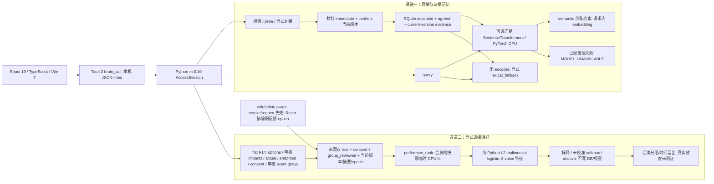

# Local hybrid understanding, evidence memory and choice preference learning

> **2026-10-06 当前限定交付（Asia/Taipei）**：schema_version=1 / contract_revision=6 / 35 methods，health.features.exact_text_duplicate_hint=true，旧 contrast guarantees 不变。最新 main session90162 exit0，620／100.682s／OK／0 skips；独立 discovery620 unique IDs／0 loader errors。Aquinas／Tesla／Franklin 三份终态 fresh reviews 无 blockers；本阶段仅接受 exact-text duplicate hint 后端，见 [最新 Oct 6 日志](../../frontback-log.md#oct-6-rev6-exact-text-duplicate-hint) 与 [当前阶段](#oct-6-rev6-exact-text-duplicate-hint)。旧 [main601／84.585s](#oct-6-offline-comparisons-and-typed-validation-performance) 与 [rev5 main576／59.590s](api.md#oct-6-final-rev5-backend-synthetic-contract) 保留历史范围。根未完成13项；broad P0/P2/P3、前端、actual weights 和真实效度仍 [ ]，broad goal ACTIVE／NOT ACHIEVED。初稿／检查点与 dated pending／PROPOSED 仅为历史。

> **2026-10-05 历史限定证明（当前状态由 Oct 6 supersede）**：main 新环境 rev3 baseline full 458 tests、181.564s、OK、0 skips；早于 evaluator 零值／数值复制修复和 rev4 组改动。旧 411 历史验收保留。后续改动及 P2/P3 整体、真实效度、前端仍待验收；下方旧状态按末尾恢复记录解读。

## 目标与授权

项目 working goal：本机有限自然语言理解＋可追溯／可编辑证据记忆＋明确选择标签的偏好 ML。SQLite 保存证据，偏好权重为可重新计算的派生层；相似度不证明事实，softmax 不代表已校准的真实选择概率。范围为个人 hybrid 后端；没有 digital-self、心理诊断、MMPI 或真实效度交付声明。

F14 自 Oct 3 已解除延期。材料 immediate/confirm 双 true、实际选择 actual_choice_id、理性事后认可 endorsed_choice_id 与独立 training_consent 分开。首版前端显式提供 options/impacts，由用户审核；不得从日记、embedding、T/F 或模型建议推定标签、影响或同意。开发授权不包含私人语料导入、live DB 操作或权重下载。

主线程目标证据（用户／main 提供）：2026-10-04 本轮开始，线程 `01a0ece3-759d-7ec0-bccc-4157827f3358` 实际 get_goal 为 status=active、objective=`continue build back-end`、tokensUsed=1773028。项目目标继续在此 scope 内。Oct 3 create_goal 因已有未完成目标被拒绝、随后 paused 是历史；早期文档 worker 的 goal=null 不代表主线程，不是当前阻碍。不另建或完成目标。

## 当前事实与证据边界

| 层 | 本机源码／文档依据 | 当前边界 |
| --- | --- | --- |
| 前端／宿主 | 根 package.json：React 19、TypeScript、Vite 7、Tauri CLI ^2.12.0；src-tauri/Cargo.toml：Tauri major 2 | Tauri 2，不是 Tauri 3；前端／Rust 各归 owner，本次仅文档。 |
| 规则与存储 | pyproject.toml Python >=3.10；translator/learning.py jieba；core/store.py SQLite；model/catalog.py 13 参数 | 词汇计数和规则参数不等于通用语义学习，observed=false 不等于测得中性。 |
| 当前扩展 | core/api.py CONTRACT_REVISION=6、METHODS 35 项；core/brain.py input_duplicates；model/contrast.py、model/ranking.py | 最新 main620／100.682s＋三份终态 fresh reviews 仅接受 exact-text duplicate hint 后端。旧 main601／84.585s 离线工具／typed validation 与 rev5 main576／59.590s contrast 证明保留历史范围；前端／整体效度仍 pending。 |
| 私有访问与备份 | core/access.py AccessSession；core/backup.py validate_database；tests/test_hybrid_backup.py | 新反馈表曾实际破坏 protected setup/access/backup；精确参考 schema 修复及合成集成已有 main／fresh 限定证明，前端 access/cache 验收仍 pending。SQLite 明文，同 OS 用户直接文件读取在 gate 范围外。 |
| 语义检索 | translator/semantic.py；core/brain.py memory_search_semantic | 可选冻结本机 encoder、请求内向量；未配置明确 lexical_fallback，配置后失败报错。最新至多 1000 候选池，非无界全集。 |
| 偏好基线 | model/preferences.py；tests/test_preferences.py | 纯 Python L2 multinomial logistic，8 个 value.*；按请求临时 fit，不写 DB/持久权重、不训练 encoder。 |
| 评测工具 | model/evaluation.py、model/readiness.py、translator/evaluation.py、model/preference_evaluation.py | 合成 evaluator、opt-in 两基线及八参数 matched-ablation 工具已限定交付；P3 report 只输出 scalar contrast_rank，不输出 raw basis／weights／私有内部变量，无自动选参／calibration／真实效度声明。 |

技术候选为 SentenceTransformers 6.1.0／PyTorch CPU；参考源码 ext-refs/sentence-transformers 为 commit `4a3b5cd6ec718e421f57e824a41ed3fd99595df6`、6.2.0.dev0，不是已安装运行版本。BGE-M3 仅候选，无模型权重下载／加载／CPU 性能或真实中文语义验收。

## 技术栈与两条通道



```text
React/TypeScript/Vite -> Tauri 2 brain_call -> Python AccessSession
 通道一：规则/jieba/纠错 -> 来源双确认 -> SQLite 活动证据记忆
          query + memories -> 可选冻结 CPU encoder -> semantic/cosine
          无 encoder -> 明确 lexical_fallback; 已配置失败 -> error
 通道二：前端 options + 用户审核 impacts + actual/endorsed + 独立 consent + 审核 event group
          -> 来源双 true + consent + group_reviewed + 当前版本/摘要/反馈 epoch 筛选
          -> 至少 3 informative groups -> preference_rank 临时分组 L2 logistic fit + 排序/解释/abstain
          -> 不写 DB/持久权重、不训练 encoder -> 后续独立留出
```

## 信号、学习与活动状态

| 字段／操作 | 实际语义 |
| --- | --- |
| immediate/confirm | 整份来源当前版本认可；规则拟合／记忆发布门，不生成 F14 标签或 consent。 |
| actual_choice_id | 实际发生的选项 ID；未知为 null，不自动推断。actual 按来源 partition 隔离。 |
| endorsed_choice_id | 事后认可的选项 ID，可不同于 actual；非空须显式有效 endorsement_partition。只有 rational endorsement 纳入 endorsed/rational target，不把 emotional/crazy 认可升级为理性认可。 |
| training_consent | 显式反馈训练授权，与保存、解锁、材料认可、读取均分开；false 不纳入。 |
| feedback.model_active | 来源 agreed＋双 true＋consent＋group_reviewed＋匹配 source_version/partition/body_digest＋反馈当前 epoch 的资格；不表示已有持久训练权重。 |
| group_id/group_reviewed | 反馈 event 的显式用户审核组；默认为 null/false，可保存草稿但不纳入线上偏好 fit。不是整份 txt 的自动分组。 |
| training_groups/training_sources | 本轴 informative groups／实际 informative source IDs 的独立计数；min3 groups 是探索门，不证明独立性或样本充分。 |
| inputRecord.model_active | 该来源规则 fit 是否属于当前规则模型 epoch；不是反馈资格，也不是选择标签。 |
| choice_feedback_set/get | guarded save 完整替换 source/event 的反馈并推进全局 input revision；get 读取。set/get 不 fit。 |
| preference_rank | 对合资格只读 snapshot 临时 CPU fit＋rank；返回 snapshot input_revision/model_epoch，不写 DB、不持久保存权重、不训练 encoder。不是纯前向读取持久模型。 |

Reset 排除旧反馈 epoch。明确 guarded feedback save 可以重新登记当前 epoch 的反馈，**不要求恢复旧规则 fit**；规则 re-review 不自动重新登记旧反馈。记忆／translator 保留不激活偏好 ML。F6 编辑／删除同事务 purge 反馈；revoke/reopen／版本或内容变化使旧反馈失效。反馈与规则的 model_active 必须独立展示。

<a id="当前源码签名rev5-后端合成契约已限定验收"></a>

## 当前源码签名（rev6 后端已限定验收）

```python
input_duplicates(source_id: str, *, limit: int = 20) -> dict
memory_search_semantic(query: str, *, partition: str | None = None,
                       limit: int = 20, min_score: float = 0.0) -> dict
choice_feedback_set(source_id: str, *, event_id: str, domain: str,
                    options: list[dict], actual_choice_id: str | None,
                    endorsed_choice_id: str | None,
                    endorsement_partition: str | None, training_consent: bool,
                    expected_source_version: int, expected_revision: int,
                    expected_epoch: int, reason: str | None = None,
                    group_id: str | None = None,
                    group_reviewed: bool = False) -> dict
choice_feedback_get(source_id: str) -> dict
preference_rank(options: list[dict], *, target: str, partition: str,
                domain: str) -> dict  # temporary fit + rank, no DB writes
```

JSON params 是闭合、平铺字段，**没有 feedback:dict**。target=actual/endorsed；domain=daily/study/relationships；partition=rational/emotional/crazy。options 的 id 在事件内唯一、不是跨事件稳定类别；impacts 只含有限 [-1,1] 的八个 value.*，缺项贡献 0 不等于真实影响为零。标签非空时必须属于 options；来源可先保存 pending 反馈，但未双确认不得拟合。

expected_revision=GLOBAL input_page.revision／reset_info.input_revision；expected_source_version=当前来源版本；expected_epoch=unlocked health 当前 epoch，不能用历史输入行 epoch 或 correction_history.revision。非负整数且非 bool；事务内再校验，冲突不自动重试。同一 source_id/event_id 完整替换，记录 current source_version、来源 partition、body_digest 和反馈 epoch。

memory_search_semantic 无 encoder 返回 mode=lexical_fallback、score_kind=none、score=null；已配置 path/provider/load/encode 失败返回 MODEL_UNAVAILABLE，不转字面结果。semantic 使用 cosine，保留 memory/evidence、截断标识。先按 accepted/agreed/current-version/partition 筛，取最新至多 1000 项后打分再 limit，返回 pool_count/pool_truncated。返回前复核全局 revision；API 再复查授权。无持久 embedding cache，不因检索发布候选。

## 偏好模型与数值

八个特征：autonomy/fairness/care/truth/security/growth/achievement/connection，字段前缀 value.*；13 个规则参数中的 affect.*／expression.* 不进入此偏好模型。每事件候选 j 的 x_ej∈[-1,1]^8，按 target/partition/domain 分组：

```text
s_ej = w · x_ej
q_ej = exp(s_ej - max_k s_ek) / sum_k exp(s_ek - max_k s_ek)
L(w) = -(1/G) sum_group g (1/n_g) sum_event e in g log q_e,y_e
       + (lambda/2) ||w||²
event loss weight = 1/(G*n_g); total group loss weight = 1/G
```

这里 G 是本 target/partition/domain 轴的 informative groups 数，n_g 是组 g 的 informative events 数；目标函数为 group means 的均值加 L2/2||w||²。每组在组间平均前只有一个权重单位，归一化后为 1/G，不是每组最终 mass=1。无标签／无可辨识 option contrast 的 event 不进入 n_g；actual/endorsed 分开拟合。

当前 rev5 源码：MIN_GROUPS=3、L2=0.1；纯 Python damped Newton／Cholesky，MAX_ITERATIONS=64、MAX_BACKTRACKS=32，返回权重的 gradient infinity norm 必须 <=1e-11。每步从 1 开始、减半 backtrack，Armijo 系数 0.01；仅在下降量处于 roundoff slack（8 ulps）内时允许 slack，且须同时降低 gradient residual。超预算／无法收敛返回 fit_not_converged，非有限 objective 返回 nonfinite_fit；top gap <=1e-8 返回 options_tied_with_learned_weights。旧 ITERATIONS=400／STEP=0.2 和 source-ID gate 是历史方案。有限数值与梯度检查不代替真实效度；rev5 contrast 工程验收见末尾 Oct 6 节。

各审核 group 总 loss 权重相同，来源 ID 不再充当 online 独立组；未审核／legacy unknown 反馈排除至明确 guarded user-reviewed save，旧 exact payload 不 backfill。pure offline caller 无 group 字段时可自行筛 provenance 后按 source-ID fallback。不同 group ID 仍不证明真实独立性；未知／不可区分标签不进入 fit，跨轴不池化。不足 3 informative groups 返回 insufficient_training_groups；training_sources 单独计实际 informative IDs。当前 used_features 检查只防未使用特征，不证明新组合方向在可辨识子空间；rev5 另对每个 query option pair 检查 span，未覆盖方向返回 unidentified_option_contrasts，unsupported_option_features 仍优先。rank_from_fit 在 float 转换前拒绝巨大整数权重并抛受控 ValueError；没有接收外部 fit weights 的 JSON endpoint。返回 weights／contributions／model_probability 带 not_calibrated=true；不能呈现为可靠实际行为概率。模型结果来自返回 tokens 所描述的快照，并发写入后可能过期。

来源筛选缓存只留 bounded metadata／body digest，不缓存完整原文或 i.*；逐个 eligible body 读取，以 65,536 code-point chunks 做 SHA-256；反馈 row 流式遍历。fit records 只保留训练字段，不留原文、reason、option label。1000 current-epoch records 上限和 payload 上限仍限制事件／options 内存，不能宣称总内存为常量。

小 MLP／LoRA 只在独立冻结留出较 logistic 有可复核增益后考虑，需再核对覆盖、泄漏、资源和删除治理；不是当前实现或验收。P1 encoder 始终冻结。

## 阶段与复制／验证路径

- [ ] **P0 契约与完整安全兼容主验收**：保留 Oct 2 rev2 已验收基线，核对 rev5 34-method allowlist/schema/results/health、一致 guards、旧／新 DB 与 backup/restore 严格兼容。参考 core/api.py METHODS/PUBLIC_METHODS/handle、core/access.py AccessSession、core/backup.py validate_database；tests/test_access_api.py、test_schema_contract.py、test_hybrid_backup.py。后端合成契约已有 main576／三份最终 reviews 限定证明；本 broad 阶段不因此勾选。
- [ ] **P1 semantic 最终合成主验收**：验证本机 encoder adapter 的 restricted builtin layout、safetensors、禁止 remote/custom/unsafe artifacts、配置失败不 fallback、输出抑制、向量形状、候选池/partition/current-version、长计算后 revision/access 复核、无持久 cache。参考 translator/semantic.py、core/brain.py memory_search_semantic、tests/test_semantic_encoder.py/test_hybrid_api.py。顶层 local_files_only 不足以证明所有嵌套配置离线；真实权重与零网络运行仍未验收。
- [ ] **P2 F14／preferences 最终合成主验收**：验证平铺签名、actual/endorsed、consent、反馈 activity 与规则 activity 分开、目标/分区/domain 隔离、guard 竞争、临时 fit 的 no-write、set/get 不 fit、purge/revoke/reopen、Reset 明确 feedback save。参考 model/preferences.py、model/sources.py purge_dependents、model/reset.py、tests/test_preferences.py/test_hybrid_api.py/test_revisions.py/test_source_governance.py/test_reset.py。F6 source_version 重置为 0 的排队歧义须客户端清队列；未来 content-revision guard 仍待办。
- [ ] **P3 分组／时间留出工具与独立效度**：合成偏好 evaluator 工具及 rev5 production guard 已限定交付，整体 P3 仍待验收；真实 labels/coverage/prediction 仍未验证。参考 model/readiness.py validate_collection/assess_readiness、model/evaluation.py read_snapshot、docs/readiness.example.json/evaluation.example.json/translator-evaluation.example.json。实际和认可目标分开，复制/摘录/改写同 group，不跨 split；冻结时间、训练暴露/ever_fitted/rule development/人工调参/model-assisted labels 留痕。拒答保留分母、ties 不伪造命中，读取测试标签不得回流训练。
- [ ] **P4 前端/native/离线模型发行**：前端 owner 完成 unlock/cache、guarded version UI、F14 labels/consent/用户审核 impacts、34-method 接线；host owner 验证 administrative Reset/reconnect、ambiguous write 后显式回读、无写重试；release owner 定义本地模型版本/hash/license manifest、依赖包与 CPU RAM/延迟/UI 响应。参考 frontend-contract-handoff.md、desktop-bridge.md、desktop-deployment.md、scripts/native/run.py、scripts/release/test_release.py。Oct 2 release/Xvfb 不等于新 encoder/F14/physical GPU 验收；在线 CI/Python3.10 仍 pending。

main 最终参考命令（本文件 worker 未执行；只使用合成材料／临时库）：

```sh
cd back-end-core
python -B -m unittest tests.test_semantic_encoder tests.test_preferences tests.test_hybrid_api tests.test_schema_contract tests.test_access_api tests.test_hybrid_backup -q
python -B -m unittest discover -s tests -q
```

使用项目选择的 Python 环境；历史证明中的 /tmp 环境路径仅对应当轮测试，不是永久 runtime，不保证后续存在。不安装依赖、不接 live DB、不为文档核对下载权重。文档审计部分不修改 src/、Rust、schema 或 core；各 owner 提供最终源码／签名、命令／结果、访问/rollback/no-write/no-network 范围和缺口，main 审核后再勾选。

## 证据记录与剩余缺口

Oct 2 历史：backend 283/0 skips、translator 7、Rust 16、release 3 及五个 Xvfb native DOM scenarios；不代表当前 hybrid 全量通过。Oct 3 中间 25 semantic pass、27 integration（7 failures/6 errors）保留在检查点，不描述现在最终结果。

Oct 4 中间证据（用户／main 提供）：

- `/tmp/alpha-verify-20261004.tPaapz/bin/python -m unittest tests.test_semantic_encoder tests.test_preferences -q`：semantic 35＋preferences 28 pass、0 skips，无 heavy dependencies；早于当前 offline protection 更新。
- `TMPDIR=/tmp/alpha-verify-20261004.tPaapz /tmp/alpha-verify-20261004.tPaapz/bin/python -B -m unittest tests.test_hybrid_api tests.test_schema_contract tests.test_access_api -q`：39 pass、0 skips，27.496s；main 独立执行，worker 仍加检查。
- backup owner 报 tests.test_hybrid_backup 12 pass/0 skips，security/access/evalaccess 54 pass/0 skips；main 已看过精确 reference schema 修复（6 行，保留 unknown/tampered DDL 拒绝）。这是已测试安全子任务证据，尚非新 hybrid 全量主验收。

//// - [x] **历史已验证子任务｜合成回归及 semantic 复跑**：main 在 back-end-core 执行 `TMPDIR=/tmp/alpha-verify-20261004.tPaapz HF_HUB_OFFLINE=1 TRANSFORMERS_OFFLINE=1 /tmp/alpha-verify-20261004.tPaapz/bin/python -B -m unittest discover -s tests -q`：396 tests、134.672s、OK、0 skips；随后同环境 `-m unittest tests.test_semantic_encoder -q`：51 tests、1.142s、OK、0 skips。其后 discovery 398 项，最后新增两项由 semantic 复跑覆盖；不是一次完整 398 项执行，不相加为互不重复测试数。
//// - [x] **历史已验证子任务｜备份兼容**：main 独立 `tests.test_hybrid_backup` 12 pass／0 skips，11.220s。

上述既有 main 证据更正此前「full-suite 仍运行」中间状态；不覆盖本次后续偏好修复或新 evaluator。semantic 为合成 export／mock，无真实权重。API owner targeted 151 distinct pass 的精确命令尚未提供。本次最终命令／结果由 main 补充，P0–P4 整体继续 [ ]。独立真实语义覆盖、实际权重加载/零网络/CPU 性能、选择预测效度、前端/native/physical 验收均未验证。**No real data used.**

## 上游参考（历史研究依据，本轮未联网）

[SentenceTransformer 官方 API](https://sbert.net/docs/package_reference/sentence_transformer/model.html)、[BAAI BGE-M3 model card](https://huggingface.co/BAAI/bge-m3) 是初稿研究链接。本轮仅按本机源码／检查点修正交接，未联网复查。上游模型能力不证明 Alpha 中文 evidence retrieval 质量、兼容性或 CPU 资源预算；具体模型仍待本地权重及环境验收。

## 偏好阶段仍未接受（Oct 4 review）

Mencius review 历史转交：最多 1000 来源完整 body 缓存潜在约 1GB（40×1m ASCII 合成约 40MB）；400 iterations near-tie winner 与 4000/Newton 不一致；huge integer float 转换 OverflowError；复制／改写 group/provenance 不保证独立；used_features 覆盖不保证新 option contrast 位于可辨识子空间。可执行未勾项见根沟通及 docs/TODO。即使最终合成测试全通过，P2 也不能据此自动验收。

## 当前实现分工（最终证据待 main）

历史分工叙述，最终 proof 已到齐；完成项对应下方 Oct 5 最终记录，整体阶段不因此勾选。

//// - [x] Goodall 已交付 digest-only 筛选缓存、收敛纯 Python solver＋near-tie abstain、huge integer weight 受控 ValueError；限定验收依据下方历史 411／fresh proof，旧 400 iterations/step=0.2 保留历史。
//// - [x] 合成 evaluator 限定交付：model/preference_evaluation.py、独立测试与 docs/preference-evaluation.md/example.json；文档整合不编辑四个 owner 文件。冻结 manifest development groups → production pure fit → 完成 held-out predictions 后才 scoring → 独立 actual/endorsed／state/domain／coverage/abstain/group metrics，最终51／main483 proof 见末尾；不是整个 P3／真实效度。
- [ ] main 提供后续最终命令／结果并安排 fresh-agent final review；仅已验证自动化子任务使用 `//// - [x]`，不勾整个 P2/P3 或真实效度。

source group/provenance 与 contrast span 的 production/live acceptance 继续待办；离线 evaluator 防跨组泄漏不等于线上已按独立组拟合。不接 DB、不导入私有实际材料、不下载或训练 encoder weights。

## 用户确认的事件组决策（2026-10-05；实现未完成）

历史 proposal（已 superseded）：rev4 已实现并限定验收，实际字段、eligibility 与归一化公式见上方当前契约／末尾最终证明。此处旧草稿及提示措辞不表示当前存在 duplicate hint；该提示仍 TODO。

**DECISION**：采用用户审核后的事件组 ID，前端显式提供；草稿 `group_id` 保持 PROPOSED，待 main 定稿。一个事件组的所有材料合计一份训练 loss 权重，不按 source_id 数量增加总 mass；actual/endorsed、partition/domain 继续隔离。后端仅提示原文完全重复，不推断不同文本属于同一事件，不自动指定 group 或授予用户审核。

//// - [x] **IMPLEMENTATION｜后端事件组字段／review gate／group means／legacy exclusion**：Descartes 已完成，main483＋三份 fresh reviews 限定验收，见末尾最终记录；不自动回填认可，前端任务继续待办。
- [ ] **前端契约验收**：main／frontend owner 定稿组输入、审核及既有反馈更新协议；所有未定字段保持 PROPOSED，未接线／未验收。

离线 manifest 的 group split 是评测边界，不等于线上组 gate 已落实。contrast span／不可辨识方向的 production 拒答仍为独立待办；本决策不勾 P2/P3 整体。

## Oct 5 中间验证（不勾新子任务）

main 转交 preferences 36 pass、22.441s、0 skips，早于最后新增测试，精确命令尚未提供。main 独立 seed804 对照 assert pass：修复后 winner=b、margin=`1.0117349352838784e-05`；旧 400-step winner=a。此为合成反例证明，不是实际预测效度或最终规模／收敛验收。最终 worker 证据、fresh reviews 和 main 最终 full-suite 齐备前，本次偏好／evaluator 新子任务保持 [ ]；Oct 4 勾项只保留既有历史范围。

## Oct 5 final worker proof — main/fresh acceptance pending

main 转交 Goodall FINAL：preferences 41＋hybrid 21＋schema 18＝80 tests，128.728s，0 skips；精确命令仍待 main。schema 改动只增 fit_not_converged reason enum，没有新增 group 字段。另含 12 backup 的 92 项独立验证及 antipattern/quality reviews 正在运行，尚不记录结果。所有新子任务维持 [ ]。

Worker dense 合成 CPU benchmark：1000 events、8 options、8 features，2.144934741 CPU seconds，最终 gradient infinity norm=2.609e-17。这是 solver 合成观测，不是 API 端到端／实际用户延迟保证。内存案例为 40 distinct sources×1,000,000 code points、1000 events：

| body／consent | Python tracemalloc peak bytes |
| --- | ---: |
| ASCII／false | 55,959 |
| ASCII／true | 2,531,834 |
| Unicode／false | 54,423 |
| Unicode／true | 5,924,752 |

这些值仅是 Python tracemalloc peak，不含 SQLite/native 分配，不能写成 native RSS 或整进程峰值。Worker instrumented test 65.940s 包含追踪与测试开销，其中 CPU 18.66s；两者均不代表正常请求延迟。最终 main 命令／fresh reviews／full-suite 仍待补充；source group 与 contrast span 的下一阶段实现不因这些证据完成。

main 独立基础后端 full discovery 已启动，精确 commands/counts/timing 待提供，不以预期 discovery 数量作结果。P3 tests/docs/example 未 ready；此轮 full 是 scoped base full proof，不是新 evaluator 或 whole hybrid 最终证明。

Oct 5 fresh reviews（main 转交）：antipattern no findings，17 pure tests／parity pass；该隔离环境未装 jsonschema，另一个 full 环境有 validator。quality no blockers、41 preferences pass；uneven mass 7/1/1 的独立 reference difference=1.18e-12，seed804 gradient=3.26e-15／max weight difference=1.89e-12，Cholesky residual=1.39e-17。quality 另测 dense 1000-event／8-option 为 1.48 CPU seconds；不与 worker 2.144934741 CPU seconds 混成单次结果，不代表正常 API 延迟。main 92 项与 scoped base full 411 项仍运行；两者通过才勾三个有限修复子项，线上 group／contrast span／整个 P2/P3 保持 [ ]。

Oct 5 Zeno 报 47 tool tests，但 tests/docs/example 曾误建于根目录；main 要求 owner 用 apply_patch 修正到 back-end-core/tests/test_preference_evaluation.py、docs/preference-evaluation.md、docs/preference-evaluation.example.json（后两者相对 back-end-core）。文档整合不改四个新 owner 文件，不链接根目录错误产物。修正后须在 back-end-core 复核命令／结果并做 fresh tool reviews；当前 411 base full 不含这 47 项，P3 交付仍待确认。

## Oct 5 scoped base acceptance（不含 P3）

main 独立 `TMPDIR=/tmp/alpha-verify-20261004.tPaapz HF_HUB_OFFLINE=1 TRANSFORMERS_OFFLINE=1 /tmp/alpha-verify-20261004.tPaapz/bin/python -B -m unittest discover -s tests -q`（back-end-core）：411 tests、170.066s、OK、0 skips，早于 P3 测试迁移，不含新 evaluator。FreshVerifier 92（41 preferences／21 hybrid／18 schema／12 backup），85.576s、无失败／skips；fresh antipattern 17 pure、quality 41 均无阻碍项。main 补充合成临时 live-API 调用确认 fit_not_converged 全量结果 schema、0 SQL writes／0 encoder calls，source hashes unchanged；不是用户 live DB。此证据更正上文运行中状态，不是整个 hybrid 或新 P3 的最终 full proof。

//// - [x] **有限修复｜digest-only 筛选缓存**：metadata/digest、逐个 body 分块 hash、流式 feedback、训练字段缓存；合成 tracemalloc 验证通过，native RSS／正常延迟不在完成范围。
//// - [x] **有限修复｜收敛与 near-tie 拒答**：当前 Newton/gradient/slack/tie 参数与 fit_not_converged、独立 reference／seed804／残差及失败路径 no-write/no-encoder 证明通过。
//// - [x] **有限修复｜巨大整数权重边界**：float 前 bounded finite 校验及受控 ValueError，合成 preference/hybrid/schema 回归通过。

source groups／review gate／legacy unknown exclusion、contrast span、整个 P2/P3、真实效度、frontend/native 均继续 [ ]。正确路径 [evaluator 说明](preference-evaluation.md) 与 [合成 manifest](preference-evaluation.example.json) 已出现；最终 P3 命令及 fresh tool reviews 仍待 main。

## Oct 5 recovery — baseline proof and pending integration

历史 recovery sequence：下方 intermediate pending 状态由最终 accepted section supersede；旧 counts／日期保留，不据此重写历史范围。

//// - [x] **限定 rev3 基线全量回归**：main 转交新终态，在 `back-end-core` 执行：

```sh
TMPDIR=/tmp/alpha-verify-20261005.SHU7GE HF_HUB_OFFLINE=1 TRANSFORMERS_OFFLINE=1 /tmp/alpha-verify-20261005.SHU7GE/bin/python -B -m unittest discover -s tests -q
```

458 tests、181.564s、OK、0 skips。此轮早于零 impact 规范化修复和 rev4 group 修改，只记录当前已提交 rev3 baseline 的限定证明，不能覆盖新变更或接受 P3 工具。411／170.066s 与三个有限修复勾项保留历史范围，不相加为独立测试总数。旧 job 97510 的终态缺失且旧环境已消失，UnknownProcess 不证明 pass；新 job 9839 提供上述证明。

新临时环境 Python 3.14.7／jsonschema 4.26.0，继承 PyNaCl；不是永久 runtime，不证明发行依赖安装、在线 CI／Python 3.10。quota 恢复后 agents 已可用，旧技能／setup 的 quota 注记不是当前任务阻碍；broad goal 继续 active。

- [ ] **P3 修复验收**：Lorentz recovery 47 tests 后发现遗漏 zero／等值 int/float impacts 被视为不同复制内容，可能虚增指标。Pauli 最终补丁的 targeted proof 为 68 pass＝51 evaluator（47 old＋4 new）＋17 pure，使用 Oct 5 临时环境，早于 concurrent groups partial edits。canonical impacts 去除精确零、统一等值数值类型，不舍入不同非零值。独立 Lorentz re-review 及 fresh anti/code-quality 仍进行中；main 重叠 51 测试遇 WIP MIN_SOURCES NameError，不作为验收。待 settled-code 新证明，不勾最终 P3。
- [ ] **rev4 online group 集成**：Descartes 已在新基线终态后开始写入，仍须源码／schema／proof 定稿。可选 `group_id:string|null`、`group_reviewed:bool=false` 暂为 PROPOSED handoff，允许 draft save；legacy exact stored payload 保持，read normalize 为 unknown/unreviewed，线上资格排除至明确 guarded user-reviewed save。training_consent、来源双 true、version/body_digest/epoch 与 group review 均需满足。
- [ ] **分组训练计数**：每个审核组总 loss mass=1；每个 target/partition/domain fit 按组归一。至少 3 个 informative training_groups，training_sources 另计实际 source IDs。pure-fit 旧调用者自行筛 provenance，可按 source IDs fallback，用于离线，不开放 UI／不绕过 online gate。最终新 reason statuses 不猜测，待 owner 交付后按源码记录。
- [ ] **事件范围与提示**：组作用于反馈 EVENT，不是整个 txt；exact-text duplicate hint 仍 TODO。后端不推断不同文本属于同事件，不自动授予审核。contrast span／真实留出／calibration／weights／GPU／frontend/native／P2/P3 整体继续待办。
- [ ] **下一安全动作**：核对最终 source signatures、API closed fields/results、reason enums 和 eligibility/count/lifecycle 实际流程；main/fresh 新证据齐备后只勾已验证子任务，不大改历史记录。

可移植的合成 CLI，从 `back-end-core` 使用项目 Python 环境运行：

```sh
python -m model.preference_evaluation --manifest docs/preference-evaluation.example.json --validate-only
python -m model.preference_evaluation --manifest docs/preference-evaluation.example.json
```

`--validate-only` 不 fit；普通 evaluator 仅用合成 manifest 进行离线临时 fit／预测／计分，无 DB／encoder／持久 weights。当前可核对的流程为 manifest 验证与 provenance 隔离 → development records → production pure fit → 先完成全部 held-out predictions → 独立 actual/endorsed scoring／coverage／group metrics；不将工具存在当成已修复或真实效度。

### Canonicalization 有限验收；report／groups 仍待终态

//// - [x] **数值复制规范化子修复**：Pauli 68 targeted pass（51 evaluator＝47 old＋4 new，17 pure；早于 groups WIP）；独立 Lorentz 51 evaluator／4.258s／0 skips，module hashes unchanged。八项 actual/endorsed intfloat／0／0.0／-0.0 reprochecks 的 heldout 与 macro=0.5、development records=4 稳定，fit／predictions identical。Mill fresh static quality no blocker；James fresh antipattern static no blocker，AST 2 parse／51 test definitions inspected，后者没有 runtime。只接受 canonicalization 子修复，非整个 P3。

- [ ] evaluator report 接 `fit['training_groups']` 的小集成待 Pauli 最终复跑；main evaluator51 session37713 已启动，未提供终态，不推断 pass。真实效度／baselines／八参数 ablation 仍待办。
- [ ] group owner checkpoint 为 92 existing／91.197s／0 skips，另 18 new／7.916s／0 skips；不合称最终 full。coherent code 已出现，final schema／backup additional tests 与 fresh group verification／quality／anti 仍进行中。字段保持 PROPOSED／未接受，待最终 source signatures 和精确证明再改当前技术流程。

### Stable deliveries — P3 工具限定交付，rev4 已实现待主验收

//// - [x] **合成离线 P3 工具限定交付**：Pauli 最终小集成以 fit['training_groups'] 报 authoritative informative_training_groups，补 sources/groups 分开计数回归，51 tests／4.695s／0 skips；main settled-code evaluator51／4.139s／0 skips（session37713）。canonicalization 未变，独立 Lorentz51／4.258s＋八项数值 repro、Mill／James no-blocker reviews 保留原有范围。只接受 synthetic tool provision；whole P3／baselines／eight-parameter ablation／real validity 继续待办。

- [ ] **rev4 online groups 已实现、待主验收**：owner 八路径已完成，文档 owner 只读核对实际 source/schema。choice_feedback_set 可选 `group_id: str|null=None`／`group_reviewed: bool=False`；所有返回 feedback 均含 normalized 两字段，health rev4／34 methods／reviewed_event_groups=true。training_sources=实际 informative source IDs，training_groups=informative groups，min3 gate reason=`insufficient_training_groups`。不再称这些代码不存在，但 frontend enablement／最终勾项仍待 main full＋三份 fresh group reviews。
- [ ] **owner final proof 与后续门**：20 group＋19 schema＝39 tests／34.034s／0 skips；旧 92 existing／91.197s／0 skips 分开保留。新 test_preference_groups.py 包含 encrypted reviewed／exact legacy payload backup、DDL／no-backfill；原 backup 文件未改。main 新 full 与 fresh3 reviews 进行中，终态齐备再切当前契约 header／health table。exact-duplicate hints／contrast span／真实留出／calibration／weights／GPU／frontend/native 仍 pending。

## Oct 5 final rev4 backend synthetic contract

//// - [x] **Reviewed-groups 后端合成契约限定交付**：rev4／34 methods，health.features.reviewed_event_groups=true；set 可选 group_id=None／group_reviewed=False，返回 feedback 均有 normalized 两字段；legacy exact payload 不 backfill，guarded user-reviewed save 前排除偏好资格。training_sources 计实际 informative IDs，training_groups 另计；min3 gate=`insufficient_training_groups`。当前 flow／签名／数学已按稳定 source 对齐。
//// - [x] **最终合成回归／独立验证执行**：main session28196 exit0，483 tests／121.151s／OK／0 skips，覆盖 final canonical＋group20＋schema19＋evaluator51 report integration。Lagrange focused51／19.543s test（20.215s wall）＋独立3／7.380s test（8.227s wall），0 skips；legacy bytes 两次重启不变，axes 隔离、不均组与独立 scalar group mean 一致、network0／DB 全部 temp、62 hashes stable。Meitner8／7.990s／0 skips＋all34 parity／12 axes，Kant9 pure＋8 guards，无 blockers；不相加重叠 test counts。精确 main／focused 命令见 [API final proof](api.md#oct-5-final-rev4-backend-synthetic-contract)。
//// - [x] **合成 P3 tool provision／canonical 子修复**：最终 owner51／4.695s、main51／4.139s、0 skips，authoritative fit['training_groups'] report 与 sources/groups 回归；独立 Lorentz51／4.258s＋八项 numeric repro／Mill／James reviews 保留范围。不是 whole P3／baselines／ablation／真实效度。

组 gate 只用于 **8-weight supervised preferences**：来源双 true＋独立 choice labels／consent／group_review＋当前 version/digest/epoch → 合资格 snapshot → preference_rank 临时 CPU group-mean fit → rank／explain／abstain。set/get 不拟合，不持久权重、不训练 encoder。原有来源双 true → translator／13-rule model／memories 不需要 choice group；input.model_active 与 feedback.model_active 独立。G informativegroups、n_g informativeevents，每事件1/(G*n_g)，每组1/G，global mean of group means＋L2/2||w||²。

- [ ] broad online groups＋contrast span：backend groups 子任务已完成，contrast-span／不可识别新方向拒答是下一模型任务。
- [ ] 前端显式 event group review／labels／impacts／consent／guards UI 与 adapters；unlock/version/F14/native 独立验收。
- [ ] exact-text duplicate hints（未实现）、P2/P3 整体、baselines／八参数 ablation／calibration／real held-out validity／实际 weights／GPU／CI 仍 pending。

六份文档达到稳定 final milestone，供 main review diff；此文档 owner 不再追加 intermediate diary，也不完成 broad goal。

## Oct 6 rev5 numeric proof and remaining scope

2026-10-06（Asia/Taipei）：main576／59.590s／OK／0 skips、session80693 exit0，
Archimedes／Chandrasekhar／Kant 三份最终 reviews 均无 blockers；精确命令、
最终四个 source hashes、输入 bounds 修复及各 review 计数见
[API final proof](api.md#oct-6-final-rev5-backend-synthetic-contract)。
这是 rev5 backend synthetic contract 的限定接受，不是整体模型／P2/P3 验收。

Public preference_rank 的 closed contrast_rank 为 0–8 整数，contrast_basis
行数等于 rank、每行八个有限 [-1,1] 坐标。八列固定为 value.autonomy、
value.fairness、value.care、value.truth、value.security、value.growth、
value.achievement、value.connection，与 baseline JSON／13-rule catalog
迭代顺序无关。每个 query option pair 均检查 span，未支持列优先返回
unsupported_option_features；其余未覆盖方向返回 unidentified_option_contrasts。
P3 evaluator report 仅输出 scalar contrast_rank，不输出 raw basis／weights／私有内部变量；
API preference_rank 仍返回 contrast_basis／learned weights。Legacy `rank` 的
value-alignment 返回形状不变，不新增 contrast metadata。

数值修复仍采用隔离的 80-digit Decimal：原 binary floats 精确转换后归一化、
deterministic pivoted twice-reorthogonalized construction，最终 basis 导出为 float。
rank／membership／orthogonality tolerances 固定为 1e-10／1e-12／1e-12，未放宽；
被 rank policy 丢弃的训练方向也没有 query membership 豁免。原 dyadic plane
false-outside 反例 residual 约 8.13e-8，修复后约 <1e-15；不同归一化探针的
3.18e-17／2.78e-17 不承诺完全相同。只记录工程合成结果，不声称形式误差界
或一般 SVD 等价，也不证明统计置信度、covariance、参数幅度、convex hull、
幅度外推、calibration 或 same-span utility validity。

Numeric owner：55 tests／8.020s；7000 dense contrasts benchmark：
3.910311s wall／3.893852s CPU，membership 0.261556s wall；
120 ill-conditioned cases 0.228128s，normal residual 约 7.16e-17。
Archimedes 独立 216 Fraction cases：2160 inside／756 outside／2772 normal
checks，最大 residual6.939e-17、0.613s。计数／timing 属各自合成证明，
不能相加为独立测试总数，不是正常 API latency 或真实效度保证。

Quality exploratory3684 checks exit1，九项错误 rank-threshold expectations
已独立解释为 expected rank6／residual6.93855e-11；完整 harness 未重跑全绿，
不标 passed。Post-bounds quality8／1.144s／0 skips 与其最终 no-blocker 状态
分别记录；旧 main574／61.668s 是 prerepair history，不覆盖最后两项 regressions。
巨大整数 option impacts 的类型／bounds 先于 math.isfinite／float，受控
ValueError／API INVALID_ARGUMENT 保持存储及进程；最终 main576 覆盖该修复。

来源 t/t → translator／13-rule model／memories 的原有分支不要求 choice groups。
只有 preference 要求独立 labels／consent／reviewed groups／当前版本摘要 epoch；
临时 read-time fit 不写 DB、持久 weights 或 encoder training，set/get 不 fit。
Frontend／一般纠错／generic replay、真实留出／baselines／ablation／calibration／
参数选择、actual weights／资源发行／GPU／CI／整个 P2/P3 仍 pending。
Root 15 项未完成，overall goal active，未 achieved；旧 rev4／483 与 dated
history 原范围保留，仅其 contrast pending 当前状态由本次限定证明 supersede。

## Oct 6 offline comparisons and typed validation performance

2026-10-06（Asia/Taipei）最新限定验收：main full session65720 exit0，
601 tests／84.585s／OK／0 skips；独立 discovery601 unique IDs／0 loader errors。
Main focused session67821 exit0，40 tests／9.939s／OK／0 skips，与 full 重叠；
owner evaluator69／3.415s 使用 DB／network denials，counts 不相加。
Lovelace verification、Linnaeus antipattern、Ramanujan quality 均 completed，
无 demonstrated blockers；精确 full 命令、CLI 证明、各 review 细节与冻结 source
hashes 以 [最新根日志](../../frontback-log.md#oct-6-offline-comparisons-and-typed-validation-performance)
为准。本次文档恢复不重跑测试／benchmark；临时 CPython3.14.7／jsonschema4.26.0
环境 `/tmp/alpha-verify-20261006.ltAAKM` 只属于该日期证明，不是永久 runtime。

//// - [x] **离线两基线工具**：显式 `--comparisons` 才启用 nonpersonal equal_weight sum heuristic 与 analytic uniform chance；chance 是解析期望，不是随机抽样或个人准确率。所有 variants 的 predictions／distributions 完成后才读取 held-out scoring labels，保留 target eligibility／consent／contamination／axis 隔离，无 automatic selection／promotion／validity claim。
//// - [x] **八参数 matched-ablation 工具**：full＋两基线＋八个固定 leave-one-feature-out 共11 variants／10 full-vs-variant pairs；原始 cohort admission／numeric dedup 一次后才 projection，projection 不再次去重，保留原始 event multiplicity／group ownership／target masking。生产 support／span／tie／convergence guards 不变；BOTH_PREDICTED 交集、original-cohort 与 equal-group denominators 披露 support loss，18 default／162 comparison fits、1000-case 上限不变。见 [比较协议](preference-evaluation.md#opt-in-offline-comparisons)。
//// - [x] **Typed validation 资源／一致性证明**：每次 validate_corrections 函数调用惰性完整重译至多一次，empty／parameter-only／pretranslation failure 为零；batch 上限64，无全局／跨调用 cache。correction_reopen 仍保留事务前后两次 validation，observations 另有翻译，不能写成每个 API request 一次。历史98,752-char／64 distinct-tone-target benchmark 的 median2.857913091s→0.057367233s、Python peak542,710→429,267B 保留原始测量，未重跑；不是 API latency／native RSS／frontend 响应保证。见 [原始性能证明](correction-performance.md)。

Main synthetic CLI exit0／stderrEmpty，11 variants／10 pairs，
automatic_selection=False／validity_claim=False／database_opened=False，
仅证明 synthetic wiring。通用项目 Python how-to 与精确 dated 命令见
[README](../README.md#oct-6-offline-tools-and-typed-validation-performance)。

- [ ] 独立真实 actual／endorsed labels、provenance／holdout、coverage／prediction／calibration／参数选择。以 holdout 比较结果选参后，该 holdout 成为 development data，最终效度须新的独立 holdout；reviewed group ID 不证明独立性。
- [ ] Broad P0/P2/P3、一般语义纠错／generic replay、frontend/native／guards／F13/F14、actual encoder weights／离线发行／资源／GPU／CI 与可选整库加密决策；exact-text duplicate hint 未在此阶段实现／验收。
- [ ] 未来统一消费 typed annotations 的用户问题仍未回答；当前 typed annotations 有意不覆盖13个规则参数，此 split 保持。

来源 t/t → translator／13-rule model／memories 与显式 labels／impacts／consent／
reviewed groups → 八参数临时 CPU preference fit 保持分开；set/get 不 fit，
不写 DB／持久 weights、不训练 encoder。Root [当前清单](../../front-back-communicate.md)
仍14项未完成，overall goal active／未 achieved；上方 Oct 6 rev5 numeric proof
及旧 dated history 不由新 suite 计数覆盖。

## Oct 6 rev6 exact-text duplicate hint

//// - [x] **2026-10-06｜Exact-text duplicate hint 后端限定交付**：schema1／rev6／35 methods，health.features.exact_text_duplicate_hint=true；main620／100.682s／OK／0 skips、discovery620 unique／0 loader errors 与三份终态 no-blocker reviews，仅验收后端。[精确命令／reviews／六个 hashes](../../frontback-log.md#oct-6-rev6-exact-text-duplicate-hint) 集中归档，本次不重跑。旧 main601／rev5 main576 与 recovery amendments 保留历史范围。

input_duplicates 是 authenticated read-only advisory；当前 stored raw SQLite
BINARY equality，不作 normalization／history／semantic／hash matching，
限量 metadata 和 total／version／revision／epoch 共用单一 read snapshot。
无 raw text／labels／weights／consent；model_active 是规则 agreed＋当前 epoch，
不是偏好资格。后端不在 submit/edit/review 内自动调用；前端可保存／编辑后显式
请求，包括 post-save trigger，其 owner 接线验收仍 pending。不自动分组／审核／
认可／consent／合并／去重／阻挡提交／refit；用户审核 event groups 仍需保留。
[API](api.md#oct-6-rev6-exact-text-duplicate-hint) 和
[handoff](frontend-contract-handoff.md#oct-6-rev6-exact-text-duplicate-hint)
规定 method＋feature 协商、stale-token guards 与私有 cache 失效。

Root13 未完成；duplicate frontend adapter／UI／cache／native 纳入既有
F14／guards／native bullets。一般语义纠错／依赖下游重放仍 pending；
本 hint 不补全 supporting provenance 或 generic dependency replay。
来源双 true→translator／13-rule model／memories 与 labels／impacts／consent／
reviewed groups→八参数临时 preference fit 保持分开，typed annotations
不自动覆盖13参数，未来统一消费用户决定仍未回答。真实留出／效度／选参、
encoder weights／资源／CI／Python3.10／前端及 broad P0/P2/P3 继续 pending；
整体目标 ACTIVE／NOT ACHIEVED。
